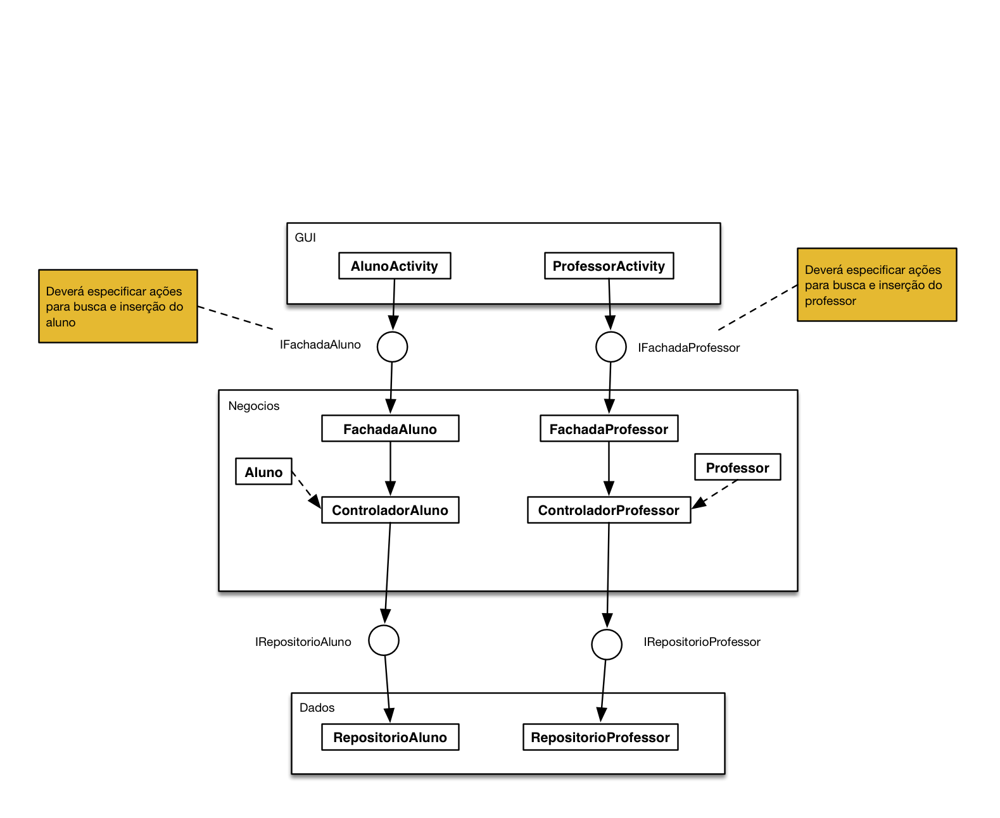

# Arquitetura em Camadas

Você deverá implementar um aplicativo em Android que tenha acesso às funcionalidades de cadastro e consulta de alunos e professores.

A arquitetura do aplicativo deverá ser feita seguindo o modelo 3 camadas. A imagem abaixo ilustra como o projeto deverá ser organizado.

